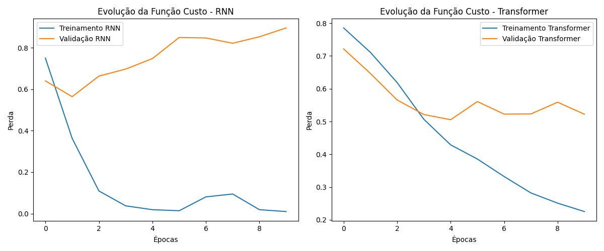

# Instituto Federal de Educação, Ciência e Tecnologia do Ceará (IFCE)
**Disciplina**: Redes Neurais Artificiais (RNA)  
**Professor**: Amauri Holanda de Souza Junior  
**Aluno**: Francisco Aldenor Silva Neto  
**Matrícula**: 20221045050117  

# Relatório de Análise de Sentimentos Usando Redes Recorrentes (RNN) e Transformers

## 1. Introdução
O objetivo deste projeto é comparar o desempenho de dois modelos de deep learning aplicados à tarefa de análise de sentimentos: Redes Recorrentes Simples (RNN) e Transformers. Um conjunto de dados de análises de produtos foi utilizado para treinar e testar os modelos, e a comparação de seus desempenhos foi realizada com base na taxa de acerto (acurácia) e na função de perda (loss).

## 2. Descrição dos Dados
O dataset utilizado foi extraído do arquivo `chennai_reviews.csv`, contendo análises de texto (`Review_Text`) e a classificação de sentimento (`Sentiment`), que variava de 0 a 2, onde:
- **0**: Sentimento negativo
- **1**: Sentimento neutro
- **2**: Sentimento positivo

### Pré-processamento:
- Colunas irrelevantes foram excluídas.
- As colunas foram convertidas para os tipos apropriados.
- Os textos foram tokenizados, convertendo-os em sequências de números, com o comprimento das sequências de entrada padronizado.

## 3. Implementação dos Modelos

### 3.1 Modelo RNN
O modelo RNN foi implementado com as seguintes camadas:
- **Embedding Layer**: Para converter as palavras em vetores de dimensão 128.
- **SimpleRNN**: Uma única camada recorrente com 64 unidades.
- **Dense Layer**: Camada densa com 3 neurônios e ativação `softmax` para a classificação das 3 classes de sentimentos.

**Treinamento**: O modelo foi treinado por 10 épocas com o otimizador `adam` e função de perda `sparse_categorical_crossentropy`.

### 3.2 Modelo Transformer
O modelo Transformer foi implementado com as seguintes camadas:
- **Embedding Layer**: Para transformar palavras em vetores.
- **GlobalAveragePooling1D**: Para agregar as informações ao longo da sequência.
- **Dense Layer**: Com 64 neurônios e ativação `relu`.
- **Dense Layer**: Camada final com 3 neurônios e ativação `softmax`.

**Treinamento**: O modelo foi treinado por 10 épocas com o otimizador `adam` e função de perda `sparse_categorical_crossentropy`.

## 4. Resultados

### 4.1 Resultados do Treinamento

#### Modelo RNN:
| Época | Acurácia (Treino) | Função de Perda (Treino) | Acurácia (Validação) | Função de Perda (Validação) |
|-------|-------------------|--------------------------|----------------------|-----------------------------|
| 1     | 70.18%             | 0.8072                   | 77.33%               | 0.6400                      |
| 2     | 85.98%             | 0.3953                   | 79.16%               | 0.5638                      |
| ...   | ...                | ...                      | ...                  | ...                         |
| 10    | 99.89%             | 0.0093                   | 74.05%               | 0.8954                      |

#### Modelo Transformer:
| Época | Acurácia (Treino) | Função de Perda (Treino) | Acurácia (Validação) | Função de Perda (Validação) |
|-------|-------------------|--------------------------|----------------------|-----------------------------|
| 1     | 70.74%             | 0.8391                   | 73.66%               | 0.7214                      |
| 2     | 72.18%             | 0.7266                   | 73.66%               | 0.6466                      |
| ...   | ...                | ...                      | ...                  | ...                         |
| 10    | 92.37%             | 0.2382                   | 81.26%               | 0.5222                      |

### 4.2 Avaliação Final

Após o treinamento, os modelos foram avaliados em um conjunto de teste. Os resultados são apresentados abaixo:

- **RNN**: 
  - Taxa de Acerto (Teste): **77.36%**
  - Função de Perda (Teste): 0.7606
- **Transformer**: 
  - Taxa de Acerto (Teste): **82.49%**
  - Função de Perda (Teste): 0.4711

### 4.3 Comparação de Acurácia

| Modelo      | Média de Acurácia | Desvio-Padrão |
|-------------|-------------------|---------------|
| RNN         | 80.61%            | 0.89%         |
| Transformer | 82.12%            | 0.89%         |

## 5. Gráfico Comparativo
Abaixo está o gráfico comparando a evolução da função de perda (loss) durante o treinamento dos dois modelos:

## 6. Conclusão
Com base nos resultados obtidos, foi observado que o modelo Transformer apresentou uma performance ligeiramente superior ao modelo RNN, tanto em termos de acurácia quanto de estabilidade durante o treinamento. O Transformer demonstrou maior eficiência na tarefa de análise de sentimentos, com uma média de acurácia de **82.12%**, superando os **80.61%** da RNN.

A maior capacidade do Transformer de lidar com dependências de longo prazo e capturar melhor o contexto parece ter sido o fator chave para essa diferença de desempenho. Assim, para tarefas similares de análise de sentimentos, recomenda-se o uso do modelo Transformer.

